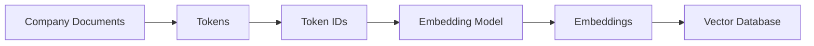
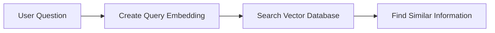
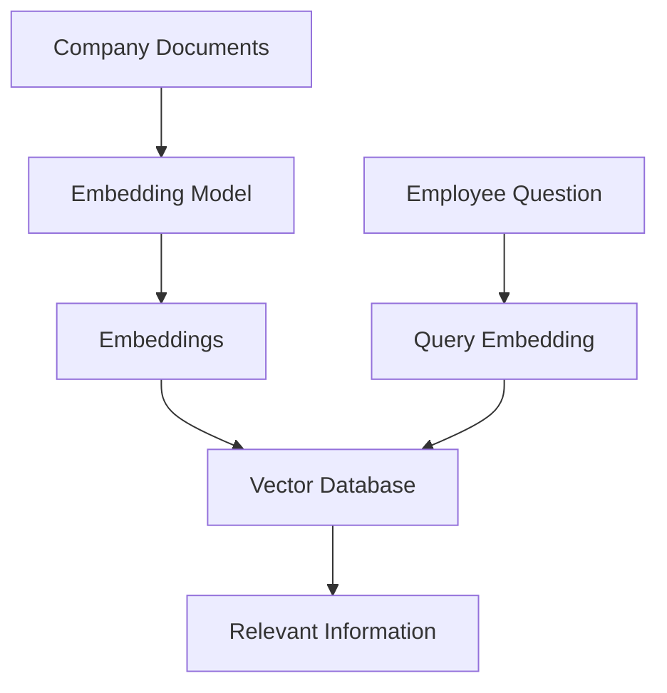
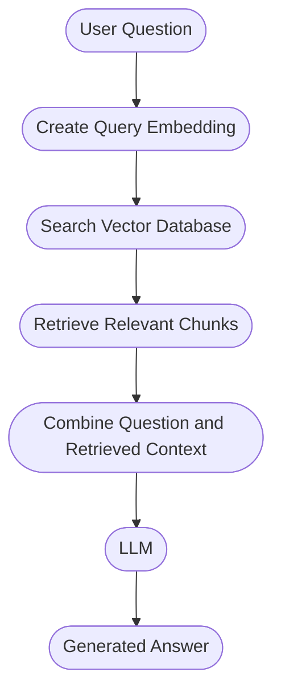

# AI Fundamentals

## Table of Contents

1. [Section 1: LLM and Introduction to LLM](#section-1-llm-and-introduction-to-llm)
2. [Section 2: Tokens](#section-2-tokens)
3. [Section 3: What Are Embeddings?](#section-3-what-are-embeddings)
4. [Section 4: Where Does AI Store Its Memories? → Vector Database](#section-4--where-does-ai-store-its-memories--vector-database)

---

# Section 1: LLM and Introduction to LLM

---

## 1.1 What is an LLM?

### Simple Definition

**LLM = Large Language Model**

An LLM is a machine-learning model trained on a very large amount of text so that it can learn **patterns and relationships in language**.

A simple way to think about it:

> **An LLM is a very powerful next-token prediction system.**

For example:

```text
Input:
"Happy birthday to"

Possible continuation:
"you"
```

The important idea is:

```text
Given previous context
        ↓
Predict the next token
        ↓
Add that token to the context
        ↓
Predict the next token
        ↓
Repeat
```

### Important clarification

The phrase **"LLM predicts the next word"** is a useful beginner analogy, but technically an LLM generally predicts the **next token**, not necessarily an entire word.

That distinction becomes important once we understand tokenization.

---

## 1.2 Why Does an LLM Seem Intelligent?

A normal autocomplete system may know common patterns such as:

```text
"Happy birthday to" → "you"
```

An LLM is trained on vastly larger datasets and can learn much more complicated patterns involving:

- language
- facts present in its training data
- writing styles
- relationships between concepts
- patterns across sentences
- programming code
- mathematical patterns

### Simple analogy

Imagine two people completing a sentence:

```text
Person A:
Has read 100 books

Person B:
Has read 10 million books
```

Person B has encountered far more language patterns.

An LLM works on the same basic idea, but at a vastly larger computational scale.

---

## 1.3 Does an LLM Read the Internet Every Time You Ask a Question?

**No.**

This is an important distinction.

A standard LLM does **not automatically search the internet for every question**.

Instead, during training, the model learns patterns from large amounts of training data. Later, when you provide a prompt, it processes that input using what it has learned.

Some AI systems **can** use web-search tools, databases, RAG systems, APIs, etc., but that is an additional capability around the model rather than the basic definition of an LLM.

---

## 1.4 The LLM Does Not Directly Process Human Text

Suppose we give an LLM:

```text
I love AI
```

Humans immediately recognize:

```text
"I"
"love"
"AI"
```

as meaningful language.

A neural network, however, ultimately performs numerical computation.

At a very high level:

```text
Human text
    ↓
Tokenization
    ↓
Tokens
    ↓
Token IDs
    ↓
Vectors / representations
    ↓
Mathematical processing
    ↓
Predicted next token
    ↓
Generated response
```

---

# Section 2: Tokens

---

## 2.1 What is a Token?

### Simple Definition

A **token is a small piece of text that the model processes.**

For example:

```text
"I love AI"
```

might be broken into something conceptually similar to:

```text
"I"
" love"
" AI"
```

But this is only an illustration.

---

## 2.2 Important: Token ≠ Word

This is one of the most important concepts.

A token is **not necessarily one complete word**.

For example:

```text
playing
```

could be split conceptually into:

```text
play
ing
```

A longer or less common word can be divided into several pieces. A word such as `"unbelievable"` can be broken into multiple token pieces. Spaces and punctuation can also participate in tokenization depending on the tokenizer.

So:

```text
1 word ≠ always 1 token
```

Instead:

```text
Text
 ↓
Tokenizer
 ↓
Tokens
```

---

## 2.3 What is Tokenization?

### Definition

**Tokenization is the process of breaking text into tokens.**

Example:

```text
Input:
"AI is amazing!"

Possible conceptual tokenization:

"AI"
" is"
" amazing"
"!"
```

The exact result depends on the tokenizer.

Different models can use different tokenization schemes, so the same text does **not necessarily produce the same tokens across different models**. Systems such as ChatGPT, Claude, and LLaMA can have different tokenizers and vocabularies.

---

## 2.4 Why Do We Need Tokens?

Computers ultimately perform computation on **numbers**.

So instead of giving the neural network raw human language directly:

```text
"I love AI"
```

the text is transformed into pieces that can ultimately be represented numerically.

A simplified pipeline is:

```text
"I love AI"
     ↓
Tokenization
     ↓
["I", " love", " AI"]
     ↓
Token IDs
     ↓
[ ... numbers ... ]
     ↓
Neural network processing
```

---

## 2.5 What is a Token ID?

Once text is tokenized, each token is associated with an **integer ID** from the model's vocabulary.

For example, purely as an illustration:

```text
Token       Token ID
--------------------
apple       745
the         2
model       81
```

These numbers are **identifiers**, not meanings.

Different models/tokenizers have different vocabularies and token-ID mappings.

---

## 2.6 Very Important — Token ID Does NOT Represent Meaning

This is the bridge to embeddings.

Imagine:

```text
dog      → 500
airplane → 501
puppy    → 9421
```

Looking only at the IDs:

```text
500
501
9421
```

we cannot conclude:

```text
dog ≈ puppy
```

and

```text
dog ≠ airplane
```

because the numbers are simply identifiers.

**Token IDs alone cannot represent semantic similarity.**

### Think of a token ID like a database ID

```text
Employee ID:
101 → Rahul
102 → Priya
999 → Amit
```

Does:

```text
101 and 102
```

mean Rahul and Priya are similar?

No.

The number is just an identifier.

The same basic principle applies to token IDs.

---

# Section 3: What Are Embeddings?

---

## 3.1 So How Does the Model Represent Meaning?

This is where **embeddings** enter the picture.

Instead of treating the token as only:

```text
dog → 500
```

the model associates it with a numerical vector.

Conceptually:

```text
dog → [0.9, 0.9, 0.0, ...]
```

A token ID selects the corresponding row/vector from a matrix, which contains many floating-point values.

---

## 3.2 What is an Embedding?

### Simple Definition

> **An embedding is a numerical vector representation of something such as a token, sentence, document, or other data.**

For our current discussion:

```text
Token
  ↓
Numerical vector
  ↓
Embedding
```

An embedding represents a token using a dense vector of numbers.

---

## 3.3 What is a Vector?

A **vector is simply a list of numbers.**

Example:

```text
[0.9, 0.2, 0.7]
```

A real model may use a vector with hundreds or thousands of dimensions rather than only three.

For learning purposes, imagine:

```text
dog → [0.9, 0.9, 0.0]
```

Each number can be thought of as representing some learned feature in an intuitive illustration.

---

## 3.4 Understanding Vector Dimensions

A simplified example with three dimensions:

```text
Dimension 1 → pet-like
Dimension 2 → has a tail
Dimension 3 → can fly
```

Then imagine:

### Dog

```text
dog → [0.9, 0.9, 0.0]
```

### Puppy

```text
puppy → [0.8, 0.8, 0.0]
```

### Airplane

```text
airplane → [0.0, 0.0, 1.0]
```

So conceptually:

```text
            Pet-like   Tail   Can-fly
Dog            0.9      0.9      0.0
Puppy          0.8      0.8      0.0
Airplane       0.0      0.0      1.0
```

These values are **not manually assigned by a person**.

The model **learns its numerical representations during training**.

### Important clarification

The "pet-like", "has a tail", etc. example is only an intuition-building visualization.

Real neural-network embedding dimensions generally do **not** correspond cleanly to human-readable labels such as:

```text
dimension 37 = "has tail"
```

Instead, the dimensions are learned numerical features whose meaning can be distributed and difficult to interpret individually.

---

## 3.5 How Does the Model Learn These Numbers?

During training, the model processes huge amounts of text and learns statistical patterns and relationships.

Over time, its parameters are adjusted so that it becomes better at its prediction task.

That learning produces numerical representations that capture useful relationships.

Conceptually:

```text
Huge amount of training text
          ↓
     Training process
          ↓
Learned model parameters
          ↓
Useful numerical representations
          ↓
Relationships between tokens/concepts
```

---

## 3.6 How Can Vectors Represent Similarity?

Imagine:

```text
Dog   → [0.9, 0.9, 0.0]
Puppy → [0.8, 0.8, 0.0]
```

They have similar numerical patterns.

Whereas:

```text
Airplane → [0.0, 0.0, 1.0]
```

looks quite different.

So we can use mathematics to compare vectors.

One mathematical operation used for this is the **dot product**.

---

## 3.7 Dot Product — Simple Understanding

Suppose:

```text
A = [0.9, 0.9, 0.0]

B = [0.8, 0.8, 0.0]
```

The dot product is:

```text
(0.9 × 0.8)
+
(0.9 × 0.8)
+
(0.0 × 0.0)
```

= **1.44**

Mathematically similar representations produce a stronger similarity signal.

---

## 3.8 Vector Space — The Big Picture

We can imagine each vector as a point in a mathematical space.

Conceptually:

```text
             Puppy
               ●
            ● Dog
         ● Cat


                         ● Airplane
```

Similar concepts can occupy nearby regions, while very different concepts may be farther apart.

### Important clarification

"Closer = more similar" is a useful intuition, but the exact similarity operation depends on the application.

For embedding search, **cosine similarity** and **dot product** are both common choices, among others.

---

## 3.9 The Complete Pipeline

Now we can connect everything.

Suppose the user asks:

```text
How do I apply for medical reimbursement?
```

A simplified pipeline is:

```text
User Query
    ↓
"How do I apply for medical reimbursement?"
    ↓
Tokenization
    ↓
Tokens
    ↓
Token IDs
    ↓
Numerical representations
    ↓
Model processing
    ↓
Learned relationships / contextual representations
    ↓
Prediction / retrieval / generation
    ↓
Answer
```

Semantically related concepts such as *reimbursement* and *refund* can be connected through numerical representations rather than exact string matching.

---

## 3.10 Exact Match vs Semantic Understanding

This distinction is extremely important for modern AI applications.

### Traditional keyword matching

Suppose a document contains:

```text
"Medical refund policy"
```

User asks:

```text
"How do I claim medical reimbursement?"
```

A simple exact keyword system may struggle because:

```text
refund ≠ reimbursement
```

as exact strings.

### Semantic approach

Embeddings allow related concepts to be represented numerically.

Conceptually:

```text
"refund"
      ↘
       Similar semantic region
      ↗
"reimbursement"
```

So a semantic retrieval system can find relevant information even when the exact words differ.

This idea leads directly into:

```text
Embeddings
     ↓
Semantic Search
     ↓
Vector Database
     ↓
RAG
```

---

## 3.11 Embeddings Are Not Only for Tokens

The beginner explanation starts with token embeddings, but the broader concept is much more powerful.

We can create embeddings for things such as:

```text
Token
Sentence
Paragraph
Document
Image
Audio
Product
User profile
```

The basic idea remains:

```text
Real-world information
        ↓
Numerical representation
        ↓
Vector
```

Then vectors can be compared mathematically.

---

## 3.12 Why Embeddings Matter in Real Applications

Suppose a company has:

```text
10,000 internal documents
```

A user asks:

```text
"How can I claim money spent on hospital treatment?"
```

The relevant document might say:

```text
"Medical reimbursement policy"
```

The wording is different, but the **meaning is related**.

A semantic retrieval system can use embeddings to identify the relevant document.

Then a RAG system can use the retrieved information to generate an answer.

---

## 3.13 Embeddings + Vector Database + RAG

This is an important mental model for your AI journey.

```text
                 USER
                   │
                   ▼
              User Query
                   │
                   ▼
              Embedding
                   │
                   ▼
           Vector Representation
                   │
                   ▼
          ┌─────────────────┐
          │ Vector Database │
          └─────────────────┘
                   │
             Similar Documents
                   │
                   ▼
              Retrieved Data
                   │
                   ▼
                 LLM
                   │
                   ▼
               Final Answer
```

This is the basic foundation behind many modern **RAG applications**.

---

## 3.14 An Important Correction: Embedding ≠ Complete "Meaning"

It is tempting to say:

> "The embedding is the meaning of the word."

That is useful for beginners, but technically it is an oversimplification.

A better statement is:

> **An embedding is a learned numerical representation that captures useful patterns and relationships in the data.**

It does not contain a perfect dictionary definition of a word.

For example, the meaning of a word can depend heavily on context:

```text
"I deposited money in the bank."

"The plane reached the river bank."
```

The word:

```text
bank
```

has different meanings depending on context.

This is one reason modern transformer models create **contextual representations** during processing rather than relying only on one fixed vector for a word/token.

---

## 3.15 Token Embedding vs Contextual Representation

This distinction will become very important later.

### At the beginning

A token ID can be mapped to an initial learned vector:

```text
Token ID
   ↓
Embedding matrix
   ↓
Initial token embedding
```

### Inside the Transformer

The model processes these representations using mechanisms such as:

```text
Attention
+
Neural-network layers
+
Other transformations
```

The representation becomes **context-dependent**.

So:

```text
"bank"
```

in:

```text
I went to the bank.
```

and:

```text
The boat reached the river bank.
```

can end up with different contextual representations.

We will study this deeply when we reach **Transformers and Attention**.

---

## 3.16 What is an Embedding Matrix?

This is a useful technical concept.

Imagine the model has:

```text
Vocabulary size = 50,000 tokens
Embedding dimension = 768
```

Conceptually, the model can have an embedding matrix:

```text
             768 dimensions
        ┌───────────────────────┐
Token 0 │ 0.12  0.91 ...        │
Token 1 │ 0.44  0.17 ...        │
Token 2 │ 0.72  0.63 ...        │
Token 3 │ 0.15  0.29 ...        │
   .    │          .            │
   .    │          .            │
Token N │ 0.31  0.78 ...        │
        └───────────────────────┘
```

A token ID effectively points to a row in this matrix.

Conceptually:

```text
Token ID = 500
       ↓
Embedding Matrix
       ↓
Row 500
       ↓
[0.21, 0.73, 0.44, ...]
```

---

# Summary & Review

---

## Tokens vs Token IDs vs Embeddings

This is one of the most important comparisons to remember.

| Concept | Meaning | Example |
|---|---|---|
| **Text** | What humans write | `"puppy"` |
| **Token** | A piece of text | `"puppy"` or a subword piece |
| **Token ID** | Integer identifier for that token | `9421` |
| **Embedding** | Numerical vector representing the token | `[0.8, 0.8, 0.0, ...]` |
| **Contextual representation** | Representation after processing context | Changes depending on surrounding text |

### Easy analogy

Think about a product in an e-commerce system:

```text
Product name
     ↓
"iPhone"
     ↓
Product ID
     ↓
48291
     ↓
Feature representation
     ↓
[screen, price, category, ...]
```

The ID identifies the item.

The feature representation helps describe its characteristics.

Similarly:

```text
Token → Token ID → Vector representation
```

---

## The Three Fundamental Concepts

At this stage, keep these three ideas very clear:

### 1. Token

> A small piece of text.

```text
"playing"
   ↓
"play" + "ing"
```

### 2. Token ID

> A numerical identifier assigned to a token in a tokenizer's vocabulary.

```text
"dog" → 500
```

### 3. Embedding

> A learned numerical vector associated with a token or other data.

```text
"dog"
  ↓
[0.9, 0.9, 0.0, ...]
```

---

## The Full Mental Model

Remember this flow:

```text
                 HUMAN
                   │
                   ▼
               Text Input
                   │
                   ▼
              Tokenization
                   │
                   ▼
                 Tokens
                   │
                   ▼
               Token IDs
                   │
                   ▼
          Embedding / Vectors
                   │
                   ▼
       Transformer Processing
                   │
                   ▼
      Contextual Representations
                   │
                   ▼
          Next-Token Prediction
                   │
                   ▼
             Generated Text
```

This is the mental model you should carry forward.


---


## Common Beginner Confusions

### ❌ Token = Word

Not always.

```text
word → one or more tokens
```

---

### ❌ Token ID = Meaning

No.

```text
500
```

is an identifier.

It does not mean:

```text
"dog is very similar to puppy"
```

---

### ❌ Embedding is a manually created feature list

No.

The model learns its numerical representations during training.

---

### ❌ LLM searches Google for every question

Not inherently.

An LLM can answer using its learned model parameters; web search or retrieval requires additional tooling/system design.

---

### ❌ LLM predicts only complete words

Technically, the model predicts **tokens**, which may be smaller than a complete word.

---

## Quick Revision ⚡

Remember this chain:

```text
TEXT
 ↓
TOKENIZATION
 ↓
TOKENS
 ↓
TOKEN IDs
 ↓
EMBEDDINGS / VECTORS
 ↓
MATHEMATICAL PROCESSING
 ↓
CONTEXTUAL REPRESENTATIONS
 ↓
NEXT-TOKEN PREDICTION
 ↓
OUTPUT
```

### The easiest way to remember it

> **Tokens tell the model what pieces of text it received.**

> **Token IDs identify those pieces.**

> **Embeddings turn them into learned numerical representations.**

> **The model processes those representations to understand patterns in context and predict what comes next.**

And this is the foundation for:

```text
Embeddings
     ↓
Semantic Search
     ↓
Vector Databases
     ↓
RAG
     ↓
Modern AI Applications
```


# Section 4 — Where Does AI Store Its Memories? → Vector Database

## 4.1 What is a Vector Database?

In the previous section, we learned that text can be converted into **tokens**, then **token IDs**, and then into **embeddings** — numerical vectors made up of floating-point numbers.

Now a new problem appears:

> **We may have thousands or millions of these embeddings. Where do we store them, and how do we search through them efficiently?**

This is where a **Vector Database** comes in.

### Simple Definition

> **A vector database is a database designed to store embeddings (vectors) and make it efficient to search for similar vectors.**

So, at a simple level:

```text
Documents
   ↓
Embeddings
   ↓
Vector Database
   ↓
Search for similar information
```

---

## 4.2 Why Do We Need a Vector Database?

Imagine a company has thousands of documents:

- HR policies
- Work-from-home policies
- Technical documentation
- HLD documents
- Architecture documents
- Confluence pages


Suppose all these documents are converted into embeddings.

We might end up with:

```text
Document 1 → Vector 1
Document 2 → Vector 2
Document 3 → Vector 3
Document 4 → Vector 4
...
Document 1,000,000 → Vector 1,000,000
```

Now we need two things:

1. **Store all these vectors**
2. **Search through them efficiently**

A normal collection of vectors would become difficult to manage and search at large scale.

A vector database is built specifically for this purpose.

---

## 4.3 Simple Real-World Example

Imagine a company wants to create an AI agent that employees can ask questions about company policies.

The company has documents containing information such as:

```text
HR Policy
Work From Home Policy
Technical Documentation
Architecture Documentation
...
```

The documents are passed through an embedding process:

```text
Company Documents
       ↓
    Embedding Model
       ↓
     Embeddings
       ↓
  Vector Database
```


---

## 4.4 What Exactly Gets Stored?

The main thing stored is the **embedding/vector**.

For example:

```text
Text:
"Employees can work from home three days a week."

        ↓

Embedding

        ↓

[0.21, 0.73, 0.44, 0.18, ...]
```

The vector database stores these vectors so they can later be searched.

It can also store **metadata** associated with those vectors, which the vector database indexes for efficient searching.

Conceptually:

```text
┌──────────────────────────────────────────────┐
│              Vector Database                 │
├──────────────────────────────────────────────┤
│ Vector                │ Metadata             │
├──────────────────────────────────────────────┤
│ [0.21, 0.73, ...]     │ work-from-home       │
│ [0.14, 0.62, ...]     │ HR policy            │
│ [0.89, 0.11, ...]     │ architecture         │
└──────────────────────────────────────────────┘
```

---

## 4.5 Vector Database Does NOT Create Embeddings

This is an important distinction.

There are two different jobs:

```text
Embedding Model
      ↓
Creates embeddings
```

and

```text
Vector Database
      ↓
Stores and searches embeddings
```


So:

> **Embedding model → creates the vector**

> **Vector database → stores and searches the vector**

---

## 4.6 A Simple Analogy

Think about a library.

### Embedding Model

The embedding model is like someone who reads each book and creates a special numerical representation describing the book.

### Vector Database

The vector database is like the library system that stores those representations and helps us quickly find the books that are most relevant to what we're looking for.

So:

```text
Embedding Model
= Creates the representation

Vector Database
= Stores + finds the representation
```

---

## 4.7 The Big Problem with Normal Keyword Search

Let's look at a company example.

Suppose the company document says:

> "Employees can work from home three days a week."

This information is stored in the vector database as an embedding.

Now an employee asks:

> "Do you support remote work?"

Notice the difference:

```text
Document → "work from home"

User     → "remote work"
```

The words are different.

A simple word-for-word search may fail to find the relevant information because it is looking for exact words.

This is where **semantic search** becomes important.

---

## 4.8 What is Semantic Search?

### Simple Definition

> **Semantic search means searching based on meaning rather than exact words.**

The word **semantic** simply means:

> **related to meaning**

So:

```text
Keyword Search
→ "Do these words match?"

Semantic Search
→ "Does this meaning match?"
```

---

## 4.9 Example: "Work From Home" vs "Remote Work"

Suppose the database contains:

```text
"Employees can work from home three days a week."
```

The user asks:

```text
"Do you support remote work?"
```

Even though:

```text
"work from home"
```

and

```text
"remote work"
```

are different phrases, they are related in meaning.

Because both are represented as vectors, we can compare their vector representations and find the relevant information.

Conceptually:

```text
"work from home"
        ↓
     Vector A


"remote work"
        ↓
     Vector B

A and B
   ↓
Similar meaning
   ↓
Relevant match
```

---

## 4.10 Semantic Search Using Vector Space

Let's use another simple example.

Suppose the vector database contains three pieces of information:

```text
A → "I love coffee"

B → "Coffee is my favorite drink"

C → "I bought an iPhone 18"
```

These can be represented as vectors:

```text
A → Vector A
B → Vector B
C → Vector C
```

Because A and B are semantically related, their vectors are close to each other.

C is about something completely different, so it is farther away.

Conceptually:

```text
              A ●
                ● B


                              ● C
```

---

## 4.11 Searching the Vector Database

Now the user asks:

> "What kind of drink do I enjoy?"

The query is converted into a vector.

Because the meaning of:

```text
"What kind of drink do I enjoy?"
```

is related to:

```text
"I love coffee"
"Coffee is my favorite drink"
```

the query vector should be closer to A and B.

So the vector database returns A and B as the most relevant results.

The basic idea is:

```text
User Query
    ↓
Query Embedding
    ↓
Search Vector Database
    ↓
Find similar vectors
    ↓
Return relevant information
```

---

## 4.12 The Complete Flow

Now connect everything we have learned so far.



This is the storage side of the system.

When a user asks a question:



So the complete picture is:

```text
                 DOCUMENT SIDE
                 -------------
Documents
    ↓
Tokens
    ↓
Token IDs
    ↓
Embedding Model
    ↓
Embeddings
    ↓
Vector Database


                 QUERY SIDE
                 ----------
User Question
    ↓
Embedding
    ↓
Vector Search
    ↓
Relevant Information
```

Once the vector database finds the relevant information, we still need to provide that information to the LLM so it can produce the final answer. That is where **RAG** comes in.

---

## 4.13 What Does a Vector Database Actually Do?

The core responsibility is simple:

```text
Vector Database
      │
      ├── Store embeddings
      │
      ├── Index embeddings
      │
      └── Search embeddings efficiently
```


It is **not** the component responsible for creating the embeddings.

---

## 4.14 Examples of Vector Databases

Some popular vector database options include:

- Pinecone
- Weaviate
- Milvus

These are different systems created by different teams, but they serve the general purpose of working with vector data.

Pinecone is an example of a service where embeddings can be stored and queried through an API.

---

## 4.15 Vector Database vs Embedding Model

This distinction is worth keeping very clear.

| Component | Main Job |
|---|---|
| **Embedding Model** | Converts data into embeddings |
| **Vector Database** | Stores and searches embeddings |

Example:

```text
Text
 ↓
Embedding Model
 ↓
[0.21, 0.73, 0.44, ...]
 ↓
Vector Database
```

Later:

```text
Question
 ↓
Embedding
 ↓
Vector Database
 ↓
Similar information
```

---

## 4.16 How This Fits Into an AI Application

Imagine a company building an internal AI agent.



The vector database acts as the place where the system keeps the vector representations of the company's information and later searches them based on meaning.

---

## 4.17 One Important Clarification About "AI Memory"

The title **"Where Does AI Store Its Memories?"** is a useful analogy.

But in this context, the vector database is storing **embeddings of external information**, such as company documents.

So think of it as:

```text
Company Knowledge
       ↓
Embeddings
       ↓
Vector Database
```

It allows an AI application to retrieve relevant information later.


---

## 4.18 The Most Important Mental Model

At this point, keep this entire chain in your mind:

```text
TEXT
  ↓
TOKENS
  ↓
TOKEN IDs
  ↓
EMBEDDINGS
  ↓
VECTOR DATABASE
  ↓
SEMANTIC SEARCH
  ↓
RELEVANT INFORMATION
  ↓
RAG
  ↓
LLM
  ↓
ANSWER
```

We have now connected the first four major concepts:

```text
LLM
 ↓
Tokens
 ↓
Embeddings
 ↓
Vector Database
```

And the next question naturally becomes:

> **"We found the relevant information in the vector database. How do we give that information to the LLM so it can answer the user?"**

That is the problem that **RAG (Retrieval-Augmented Generation)** is introduced to solve.


# Section 5 — How to Give ChatGPT Your Private Data: RAG

## 1. The Problem: LLMs Don't Automatically Know Your Private Data

Imagine a company wants to build an AI assistant that answers employees' questions about internal company policies.

The company has many documents:

- HR policies
- Work-from-home policies
- Technical documentation
- Confluence pages
- Architecture documents

Now, employees want to ask questions such as:

> "What is my company's work-from-home policy?"

The company decides to use an existing LLM, such as GPT, Claude, Gemini, or Llama.

However, there is a problem.

The LLM may have learned general information during training, but it does not automatically know the company's private internal documents.

These documents are not necessarily part of its training data.

### How can we give this information to the LLM?

One possible solution is to retrain the LLM using the company's internal documents.

But retraining a large model can be expensive and time-consuming.

We need another way to provide the model with the relevant company information whenever someone asks a question.

This is the problem that RAG helps solve.

## 2. What Is RAG?

RAG stands for Retrieval-Augmented Generation.

Let's understand the term in simple language:

- Retrieval: Find relevant information from an external data source.
- Augmented: Add that information to the context available to the LLM.
- Generation: Let the LLM generate an answer using the question and the additional information.

### Simple definition

> RAG is a workflow that retrieves relevant information from an external knowledge source and provides it to an LLM so that the LLM can generate a more relevant answer.

Instead of retraining the entire model with company documents, we retrieve the information needed for a particular question and give it to the model when it answers.

The basic idea is:

```
User Question
      |
      v
Find Relevant Information
      |
      v
Give Information to the LLM
      |
      v
Generate an Answer
```

## 3. Before Understanding RAG, Let's Understand Chunking

In the previous section, we learned that embeddings are stored in a vector database.

But what happens when a company has a huge PDF containing thousands of pages?

Do we convert the entire PDF into one single embedding?

No. Instead, the document is divided into smaller pieces called chunks.

### What Is Chunking?

> Chunking is the process of dividing a large document into smaller pieces of text.

For example, imagine an HR policy document contains information about leave, work-from-home policies, and employee conduct.

We can divide it into smaller chunks:

```
Original HR Policy Document
          |
          v
   +-------------------+
   |     Chunk 1       |
   |    Leave Policy   |
   +-------------------+
          |
          v
   +-------------------+
   |     Chunk 2       |
   | Work-from-Home    |
   +-------------------+
          |
          v
   +-------------------+
   |     Chunk 3       |
   | Employee Conduct  |
   +-------------------+
```

Each chunk contains a smaller portion of the original document.

This makes it possible to retrieve the specific information relevant to a user's question rather than searching through an entire large document as one unit.

### What Happens to Each Chunk?

Each chunk goes through an embedding model to generate its embedding.

The embedding and the associated information are then stored in a vector database.

```
Company Documents
        |
        v
     Chunking
        |
        v
   Individual Chunks
        |
        v
   Embedding Model
        |
        v
     Embeddings
        |
        v
  Vector Database
```

Conceptually, each stored record can contain:

| Field         | Purpose                                          |
| ------------- | ------------------------------------------------ |
| Chunk ID      | Identifies the stored chunk                      |
| Original text | Contains the actual text                         |
| Embedding     | Numerical representation of the text             |
| Metadata      | Additional information associated with the chunk |

The important idea is that the vector database stores the representations and associated information needed to find the relevant text later.

## 4. How RAG Works — Step by Step

Let's continue with our company example.

Suppose a document contains the following information:

> Employees can work from home three days a week.

This document has already been divided into chunks, converted into embeddings, and stored in a vector database.

Now an employee asks:

> "What is my company's work-from-home policy?"

The RAG workflow helps the LLM find and use the relevant information.

### Step 1: The User Asks a Question

```
"What is my company's work-from-home policy?"
```

The application receives this question.

### Step 2: Convert the Question into an Embedding

The question is passed through an embedding model to create its vector representation.

```
User Question
      |
      v
Embedding Model
      |
      v
Query Embedding
```

The query embedding represents the question numerically.

### Step 3: Search the Vector Database

The query embedding is used to search the vector database for relevant chunks.

For example, the database might contain:

```
Chunk A:
"Employees can work from home three days a week."

Chunk B:
"Employees receive annual leave according to company policy."

Chunk C:
"All employees must complete security training."
```

The first chunk is the most relevant to the user's question.

The vector database returns the relevant information based on the search.

```
Query Embedding
       |
       v
 Vector Database
       |
       v
Relevant Chunks
```

### Step 4: Provide the Retrieved Information to the LLM

The RAG workflow takes the user's original question and the retrieved text and combines them into the context provided to the LLM.

Conceptually, the prompt could look like this:

```
User Question:
What is my company's work-from-home policy?

Relevant Company Information:
Employees can work from home three days a week.

Instruction:
Answer the user's question using the information provided.
```

The LLM now has access to the relevant company information within its current input context.

The model does not need to be retrained just to receive this information.

### Step 5: The LLM Generates the Answer

Using the question and the retrieved information, the LLM can generate an answer such as:

```
According to the provided company policy,
employees can work from home three days a week.
```

The complete process looks like this:



This is the central idea behind RAG.

## 5. The Most Important Concept: RAG Is a Workflow, Not a Single Tool

RAG is not simply a software package that you download and use as a complete system.

It is an architecture or workflow that connects different components.

A typical workflow includes:

```
Documents
    |
    v
Chunking
    |
    v
Embedding Model
    |
    v
Vector Database
    |
    |         User Question
    |                |
    |                v
    |         Query Embedding
    |                |
    +-------> Vector Search
                     |
                     v
            Retrieved Chunks
                     |
                     v
             LLM + Context
                     |
                     v
                 Answer
```

The individual components have different responsibilities:

- Chunking: Divides documents into smaller pieces.
- Embedding model: Converts text into numerical vectors.
- Vector database: Stores embeddings and helps find relevant information.
- RAG workflow: Connects retrieval with the LLM's generation process.
- LLM: Generates the response using the provided question and context.

Understanding how these components work together is more important than treating RAG as a single product.

## 6. Why Is RAG Useful?

RAG is particularly useful when an AI application needs to answer questions using information that is not already available in the model's learned knowledge.

### 1. Work with Private Company Documents

A company can make internal policies, technical documentation, and other authorized documents available to an AI application through retrieval.

### 2. Avoid Retraining the Entire Model

Instead of retraining an LLM whenever external information needs to be supplied, the application can retrieve relevant information and provide it as context.

### 3. Provide Only Relevant Information

Imagine a company has 100,000 document chunks.

An employee asks about the work-from-home policy.

The application does not need to provide all 100,000 chunks to the LLM. It retrieves the relevant information and supplies that information with the question.

```
All Company Information
          |
          v
   Retrieve Relevant
      Information
          |
          v
     Selected Chunks
          |
          v
          LLM
```

This helps avoid sending the entire knowledge base to the model for every question.

### 4. Build Internal Knowledge Assistants

RAG can be used to build AI applications that answer questions using an organization's internal knowledge base, including company policies, support documentation, and technical documents.

## 7. Important Design Decisions in RAG

Building a RAG workflow involves several design decisions. The transcript highlights the following.

### A. Chunk Size

Chunk size means how much text is included in each chunk.

Consider two extremes.

Chunks that are too large

A single chunk might contain several unrelated topics. When retrieved, it may include unnecessary information that distracts from the relevant content.

Chunks that are too small

A chunk might contain too little information to explain the topic properly. It may lose the surrounding context needed to understand its meaning.

Therefore, we need to find a suitable balance.

```
Too Large
   |
   v
More Irrelevant Information

Too Small
   |
   v
Potentially Missing Context

Balanced Size
   |
   v
Useful, Meaningful Chunks
```

The appropriate size depends on the documents and the information the application needs to retrieve.

### B. Choice of Embedding Model

The embedding model converts document chunks and user questions into vectors.

The choice of embedding model affects how information is represented and, consequently, how well the system can retrieve relevant content.

### C. Number of Chunks to Retrieve

When a user submits a question, the system must decide how many relevant chunks to retrieve from the vector database.

Retrieving too few chunks may omit useful information. Retrieving too many may introduce unnecessary content into the LLM's context.

These decisions are important when designing the RAG workflow.

## 8. Tools and Platforms Mentioned in the Transcript

The transcript mentions a few options for building or using RAG-based solutions.

### Enterprise Solutions

- Glean
- Amazon Q

These are examples of enterprise-oriented solutions that companies can use to access organizational information through AI.

### Open-Source Frameworks

- LangChain
- LlamaIndex

These provide tools that developers can assemble to build their own RAG workflows.

The distinction presented in the transcript is that some enterprise solutions are available as more complete offerings, whereas open-source frameworks provide components that developers use to construct their own applications.

These tools are ways to implement or use RAG; RAG itself is the underlying workflow, not a particular framework.

## 9. Connecting Everything We Have Learned

Let's connect the previous sections to this one.

### Section 1: LLM

An LLM generates text by predicting tokens based on the input context.

### Section 2: Tokens

Text is divided into smaller units called tokens, which are represented by numerical token IDs.

### Section 3: Embeddings

An embedding model converts text into numerical vectors that can be used to compare related information.

### Section 4: Vector Database

A vector database stores embeddings and supports searching for relevant, similar information.

### Section 5: RAG

RAG retrieves relevant information from the vector database and provides it to the LLM as additional context.

\#chatgpt-mermaid-\_r_1rb\_{font-family:-apple-system-body,ui-sans-serif,-apple-system,system-ui,"Segoe UI","Helvetica","Apple Color Emoji","Arial",sans-serif,"Segoe UI Emoji","Segoe UI Symbol";font-size:16px;fill:rgb(13, 13, 13);}@keyframes edge-animation-frame{from{stroke-dashoffset:0;}}@keyframes dash{to{stroke-dashoffset:0;}}#chatgpt-mermaid-\_r_1rb\_ .edge-animation-slow{stroke-dasharray:9,5!important;stroke-dashoffset:900;animation:dash 50s linear infinite;stroke-linecap:round;}#chatgpt-mermaid-\_r_1rb\_ .edge-animation-fast{stroke-dasharray:9,5!important;stroke-dashoffset:900;animation:dash 20s linear infinite;stroke-linecap:round;}#chatgpt-mermaid-\_r_1rb\_ .error-icon{fill:rgb(243, 243, 243);}#chatgpt-mermaid-\_r_1rb\_ .error-text{fill:rgb(13, 13, 13);stroke:rgb(13, 13, 13);}#chatgpt-mermaid-\_r_1rb\_ .edge-thickness-normal{stroke-width:1px;}#chatgpt-mermaid-\_r_1rb\_ .edge-thickness-thick{stroke-width:3.5px;}#chatgpt-mermaid-\_r_1rb\_ .edge-pattern-solid{stroke-dasharray:0;}#chatgpt-mermaid-\_r_1rb\_ .edge-thickness-invisible{stroke-width:0;fill:none;}#chatgpt-mermaid-\_r_1rb\_ .edge-pattern-dashed{stroke-dasharray:3;}#chatgpt-mermaid-\_r_1rb\_ .edge-pattern-dotted{stroke-dasharray:2;}#chatgpt-mermaid-\_r_1rb\_ .marker{fill:rgb(143, 143, 143);stroke:rgb(143, 143, 143);}#chatgpt-mermaid-\_r_1rb\_ .marker.cross{stroke:rgb(143, 143, 143);}#chatgpt-mermaid-\_r_1rb\_ svg{font-family:-apple-system-body,ui-sans-serif,-apple-system,system-ui,"Segoe UI","Helvetica","Apple Color Emoji","Arial",sans-serif,"Segoe UI Emoji","Segoe UI Symbol";font-size:16px;}#chatgpt-mermaid-\_r_1rb\_ p{margin:0;}#chatgpt-mermaid-\_r_1rb\_ .label{font-family:-apple-system-body,ui-sans-serif,-apple-system,system-ui,"Segoe UI","Helvetica","Apple Color Emoji","Arial",sans-serif,"Segoe UI Emoji","Segoe UI Symbol";color:rgb(13, 13, 13);}#chatgpt-mermaid-\_r_1rb\_ .cluster-label text{fill:rgb(13, 13, 13);}#chatgpt-mermaid-\_r_1rb\_ .cluster-label span{color:rgb(13, 13, 13);}#chatgpt-mermaid-\_r_1rb\_ .cluster-label span p{background-color:transparent;}#chatgpt-mermaid-\_r_1rb\_ .label text,#chatgpt-mermaid-\_r_1rb\_ span{fill:rgb(13, 13, 13);color:rgb(13, 13, 13);}#chatgpt-mermaid-\_r_1rb\_ .node rect,#chatgpt-mermaid-\_r_1rb\_ .node circle,#chatgpt-mermaid-\_r_1rb\_ .node ellipse,#chatgpt-mermaid-\_r_1rb\_ .node polygon,#chatgpt-mermaid-\_r_1rb\_ .node path{fill:rgb(222, 234, 251);stroke:rgb(83, 154, 248);stroke-width:1px;}#chatgpt-mermaid-\_r_1rb\_ .rough-node .label text,#chatgpt-mermaid-\_r_1rb\_ .node .label text,#chatgpt-mermaid-\_r_1rb\_ .image-shape .label,#chatgpt-mermaid-\_r_1rb\_ .icon-shape .label{text-anchor:middle;}#chatgpt-mermaid-\_r_1rb\_ .node .katex path{fill:#000;stroke:#000;stroke-width:1px;}#chatgpt-mermaid-\_r_1rb\_ .rough-node .label,#chatgpt-mermaid-\_r_1rb\_ .node .label,#chatgpt-mermaid-\_r_1rb\_ .image-shape .label,#chatgpt-mermaid-\_r_1rb\_ .icon-shape .label{text-align:center;}#chatgpt-mermaid-\_r_1rb\_ .node.clickable{cursor:pointer;}#chatgpt-mermaid-\_r_1rb\_ .root .anchor path{fill:rgb(143, 143, 143)!important;stroke-width:0;stroke:rgb(143, 143, 143);}#chatgpt-mermaid-\_r_1rb\_ .arrowheadPath{fill:rgb(143, 143, 143);}#chatgpt-mermaid-\_r_1rb\_ .edgePath .path{stroke:rgb(143, 143, 143);stroke-width:1px;}#chatgpt-mermaid-\_r_1rb\_ .flowchart-link{stroke:rgb(143, 143, 143);fill:none;}#chatgpt-mermaid-\_r_1rb\_ .edgeLabel{background-color:rgb(252, 252, 252);text-align:center;}#chatgpt-mermaid-\_r_1rb\_ .edgeLabel p{background-color:rgb(252, 252, 252);}#chatgpt-mermaid-\_r_1rb\_ .edgeLabel rect{opacity:0.5;background-color:rgb(252, 252, 252);fill:rgb(252, 252, 252);}#chatgpt-mermaid-\_r_1rb\_ .labelBkg{background-color:rgba(252, 252, 252, 0.5);}#chatgpt-mermaid-\_r_1rb\_ .cluster rect{fill:rgb(243, 243, 243);stroke:rgba(0, 0, 0, 0.1);stroke-width:1px;}#chatgpt-mermaid-\_r_1rb\_ .cluster text{fill:rgb(13, 13, 13);}#chatgpt-mermaid-\_r_1rb\_ .cluster span{color:rgb(13, 13, 13);}#chatgpt-mermaid-\_r_1rb\_ div.mermaidTooltip{position:absolute;text-align:center;max-width:200px;padding:2px;font-family:-apple-system-body,ui-sans-serif,-apple-system,system-ui,"Segoe UI","Helvetica","Apple Color Emoji","Arial",sans-serif,"Segoe UI Emoji","Segoe UI Symbol";font-size:12px;background:rgb(243, 243, 243);border:1px solid rgba(0, 0, 0, 0.1);border-radius:2px;pointer-events:none;z-index:100;}#chatgpt-mermaid-\_r_1rb\_ .flowchartTitleText{text-anchor:middle;font-size:18px;fill:rgb(13, 13, 13);}#chatgpt-mermaid-\_r_1rb\_ rect.text{fill:none;stroke-width:0;}#chatgpt-mermaid-\_r_1rb\_ .icon-shape,#chatgpt-mermaid-\_r_1rb\_ .image-shape{background-color:rgb(252, 252, 252);text-align:center;}#chatgpt-mermaid-\_r_1rb\_ .icon-shape p,#chatgpt-mermaid-\_r_1rb\_ .image-shape p{background-color:rgb(252, 252, 252);padding:2px;}#chatgpt-mermaid-\_r_1rb\_ .icon-shape .label rect,#chatgpt-mermaid-\_r_1rb\_ .image-shape .label rect{opacity:0.5;background-color:rgb(252, 252, 252);fill:rgb(252, 252, 252);}#chatgpt-mermaid-\_r_1rb\_ .label-icon{display:inline-block;height:1em;overflow:visible;vertical-align:-0.125em;}#chatgpt-mermaid-\_r_1rb\_ .node .label-icon path{fill:currentColor;stroke:revert;stroke-width:revert;}#chatgpt-mermaid-\_r_1rb\_ .node .neo-node{stroke:rgb(83, 154, 248);}#chatgpt-mermaid-\_r_1rb\_ [data-look="neo"].node rect,#chatgpt-mermaid-\_r_1rb\_ [data-look="neo"].cluster rect,#chatgpt-mermaid-\_r_1rb\_ [data-look="neo"].node polygon{stroke:url(#chatgpt-mermaid-\_r_1rb\_-gradient);filter:drop-shadow( 1px 2px 2px rgba(185,185,185,1));}#chatgpt-mermaid-\_r_1rb\_ [data-look="neo"].swimlane.cluster rect{filter:none;}#chatgpt-mermaid-\_r_1rb\_ [data-look="neo"].node path{stroke:url(#chatgpt-mermaid-\_r_1rb\_-gradient);stroke-width:1px;}#chatgpt-mermaid-\_r_1rb\_ [data-look="neo"].node .outer-path{filter:drop-shadow( 1px 2px 2px rgba(185,185,185,1));}#chatgpt-mermaid-\_r_1rb\_ [data-look="neo"].node .neo-line path{stroke:rgb(83, 154, 248);filter:none;}#chatgpt-mermaid-\_r_1rb\_ [data-look="neo"].node circle{stroke:url(#chatgpt-mermaid-\_r_1rb\_-gradient);filter:drop-shadow( 1px 2px 2px rgba(185,185,185,1));}#chatgpt-mermaid-\_r_1rb\_ [data-look="neo"].node circle .state-start{fill:#000000;}#chatgpt-mermaid-\_r_1rb\_ [data-look="neo"].icon-shape .icon{fill:url(#chatgpt-mermaid-\_r_1rb\_-gradient);filter:drop-shadow( 1px 2px 2px rgba(185,185,185,1));}#chatgpt-mermaid-\_r_1rb\_ [data-look="neo"].icon-shape .icon-neo path{stroke:url(#chatgpt-mermaid-\_r_1rb\_-gradient);filter:drop-shadow( 1px 2px 2px rgba(185,185,185,1));}#chatgpt-mermaid-\_r_1rb\_ .node text{font-size:14px;font-weight:600;letter-spacing:normal;fill:rgb(0, 79, 153);}#chatgpt-mermaid-\_r_1rb\_ .edgeLabels text{font-size:13px;font-weight:600;letter-spacing:-0.08px;fill:rgb(0, 79, 153);}#chatgpt-mermaid-\_r_1rb\_ .node tspan[font-weight="normal"],#chatgpt-mermaid-\_r_1rb\_ .edgeLabels tspan[font-weight="normal"]{font-weight:600;}#chatgpt-mermaid-\_r_1rb\_ .edgeLabel .label rect{opacity:1;rx:13px;ry:13px;fill:rgb(245, 250, 255);stroke:rgb(206, 219, 229);stroke-width:1px;}#chatgpt-mermaid-\_r_1rb\_ .node rect,#chatgpt-mermaid-\_r_1rb\_ .node circle,#chatgpt-mermaid-\_r_1rb\_ .node ellipse,#chatgpt-mermaid-\_r_1rb\_ .node polygon,#chatgpt-mermaid-\_r_1rb\_ .node path{fill:rgb(229, 243, 255);stroke:rgba(0, 0, 0, 0.1);stroke-width:1px;}#chatgpt-mermaid-\_r_1rb\_ .node rect{rx:16px;ry:16px;}#chatgpt-mermaid-\_r_1rb\_ .node.mermaid-decision .label-container{fill:rgb(245, 250, 255);stroke:rgb(206, 219, 229);stroke-dasharray:2px,2px;}#chatgpt-mermaid-\_r_1rb\_ .edgePaths .flowchart-link{stroke:rgb(143, 143, 143);stroke-width:1px;stroke-linecap:round;stroke-linejoin:round;}#chatgpt-mermaid-\_r_1rb\_ .marker{fill:rgb(143, 143, 143);stroke:rgb(143, 143, 143);}#chatgpt-mermaid-\_r_1rb\_ :root{--mermaid-font-family:-apple-system-body,ui-sans-serif,-apple-system,system-ui,"Segoe UI","Helvetica","Apple Color Emoji","Arial",sans-serif,"Segoe UI Emoji","Segoe UI Symbol";}Company DocumentsChunkingEmbedding ModelVector DatabaseUser QuestionQuery EmbeddingRelevant ChunksQuestion + Retrieved ContextLLMGenerated Answer

This is how the concepts fit together to support an AI application that can answer questions using external knowledge.

## 10. What Comes Next?

We now understand how an LLM can receive information from an external knowledge source without requiring the entire model to be retrained.

But another question remains:

How does the LLM actually process the words and context it receives to produce an answer?

How does it use the relationships between words in a sentence? How does it determine which parts of the input are relevant to one another?

To explore those questions, we need to understand the Transformer architecture, which is the next topic in the learning journey.